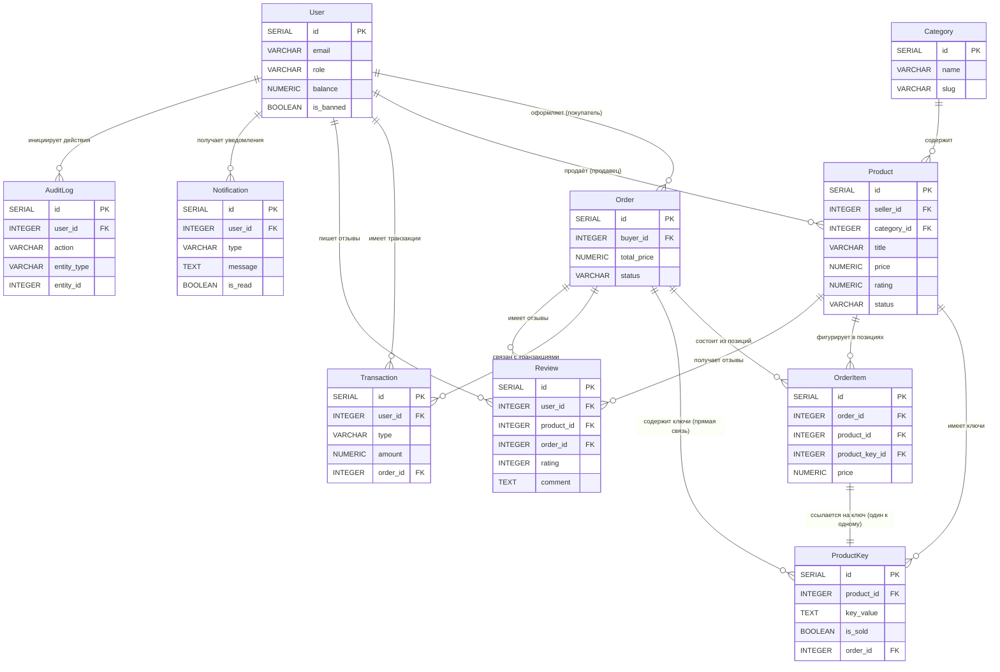

# Вопросы для самопроверки

**1. Чем отличается 1:N от M:N? Примеры из проекта.**

**Ответ:**

N — одна запись A связана с несколькими B, но каждая B к одной A.
Пример: User → Product (продавец → товары).

M:N — многие A связаны со многими B. Реализуется через третью таблицу.
Пример: Покупатели и товары (через OrderItem).

**2. Почему M:N нельзя через две таблицы? Зачем промежуточная?**

**Ответ:**

Нельзя, потому что FK можно поставить только в одну сторону. Промежуточная таблица разбивает M:N на две связи 1:N и хранит атрибуты связи (цену, количество).

**3. Что будет при удалении записи, на которую ссылается FK?**

**Ответ:**

Зависит от каскадного поведения:

RESTRICT — ошибка, если есть дети.

CASCADE — удалятся и дети.

SET NULL — FK станет NULL.

**4. Может ли FK быть NULL? Когда полезно?**

Да, если поле не NOT NULL. Полезно для необязательных связей:

ProductKey.order_id = NULL (ключ ещё не продан).

AuditLog.user_id = NULL (системное действие).
